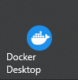
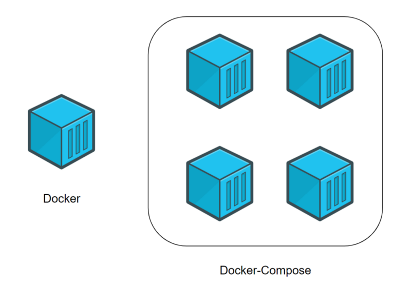

<style>
html {
  scroll-behavior: smooth!important;
}
</style>

TorchServe - это фреймворк с открытым исходным кодом для сервинга PyTorch моделей. Для запуска простой модели достаточно реализовать функции пре-процессинга и пост-процессинга.

Детальнее про фреймворк можно почитать в [документации](https://pytorch.org/serve/)

### **Содержание**
1. [Быстрое начало (Windows)](#fast-windows)
2. [Архивируем модель](#archive-model)
   1. [Как Torchserve видит модели](#how-torch-serve)
   2. [handler (обработчик)](#handler)
   3. [Пишем свой обработчик](#our-handler)
   4. [Утилиа torch-model-archiver](#torch-model-archiver)
3. [Docker](#docker)

<br>

---

<br>

## <a id="fast-windows"></a>🚀 Быстрое начало (Windows)


### **Забрать [репозиторий с Torchserve](https://github.com/Aleksey512/Torchserve)**

* С помощью командной строки

```shell
git clone https://github.com/Aleksey512/Torchserve.git

# Или если есть SSH ключ

git clone git@github.com:Aleksey512/Torchserve.git 
```
 
* С помощью IDE (На примере [PyCharm](https://www.jetbrains.com/ru-ru/pycharm/))
 


### **Установить [Docker](https://www.docker.com/)**

Для него понадобится установить wsl2
 
Для этого открывам PowerShell с правами администратора и выполняем команду

 ```shell
 wsl --install
```

Подробный процесс установки описан на сайте [Microsoft](https://docs.microsoft.com/ru-ru/windows/wsl/install-win10), там же указаны минимальные требования.

Далее устанавливаем сам **[Docker](https://www.docker.com/)**, следуя инструкции на сайте

### **Предварительная подготовка**

<a if="mymodel"></a>[Скачиваем](https://www.kaggle.com/datasets/boliu0/melanoma-winning-models) и помещаем нашу модель (***9c_b7ns_1e_640_ext_15ep.pth***)
в папку ***model_dir*** и переименовываем модель в ***model.pth***

### **Запуск**

1. Запускаем DockerDesktop 
2. Запускаем PowerShell
3. Переходим в папку с проектом
    ```shell
    cd путь/до/папки/
    ```
4. Выполняем команду
    ```
    docker compose up --build   
   ```
   
### 😊 **Поздравляю сервер запущен**

Что бы посмотреть какие модели у нас есть, в строке браузера наберите:

```djangourlpath
http://localhost:8081/models
```
Примерный вывод:
```JSON
{
   "model_name": "model", 
   "model_url": "model.pth"
}
```

Для того что бы отправить данные в нашу модель, необходимо отправить POST запрос, и в body указать флаг **file** = photo.jpg по адрессу:
```djangourlpath
http://localhost:8080/predictions/ИМЯ_МОДЕЛИ
```

Примерный вывод:

```JSON
{
  "melanoma": 0.91493821144104,
  "nevus": 0.005232867784798145
}
```

Этот флаг, как и отправляемые, получаемые данные можно изменять в файле обработчика модели (***handler.py***)

<br>

---

<br>

## <a id="archive-model"></a> 🚀 Архивируем модель

### <a id="how-torch-serve"></a> **Как TorchServe видит модели**

TorchServe требует от пользователя перевести модели в свой формат. Данный формат предстоваляет из себя архив вида *.mar. Внутри которого есть все для успешной работы модели. 

Для перевода модели в архив, есть утилита **torch-model-archiver**

Для конвертации нам нужно:

* Модель в формате TorchServe/Onnx/др.;

* Скрипт, описывающий пайплайн работы модели.

Такой скрипт называется handler. В нем определяются основные этапы жизненного цикла модели (инициализация, предобработка, предсказание, постобработка и др.). 

### <a id="handler"></a> **Handler**

Сам обработчик представляет собой *.py файл, с классом [обработчика](https://pytorch.org/serve/custom_service.html#custom-handler-with-class-level-entry-point).
Для типовых задач они уже [предопределены](https://pytorch.org/serve/#default-handlers).

Разберем из чего состоит файл handler для нашей [модели](#mymodel)

<a id="our-handler"></a>

Импорты выглядят так:
```python
# Input/Output
import io

# Сам торч, логи, доступ к ОС
import torch
import logging
import os

# Pillow, torcvision для работы с изображением
from PIL import Image
from torchvision import transforms

# Класс обработчика
from ts.torch_handler.base_handler import BaseHandler

# Архитектура нашей модели
from model import enetv2
```

Класс обработчика как говорилось выше состоит из инициализации, предобработки, предсказания, постобработки и др.

Инициализация:
```python
class ModelHandler(BaseHandler):
    
    def initialize(self, context):
        """Класс инициализации
        Args:
            context (context): Это объект JSON, содержащий информацию 
            относящуюся к параметрам артефактов модели
        """

        properties = context.system_properties
        self.manifest = context.manifest # Загружаем модель

        logger.info(f'Properties: {properties}') 
        logger.info(f'Manifest: {self.manifest}')

        self.device = torch.device('cpu')
        
        model_file = self.manifest["model"].get("modelFile", "") # Читаем файл модели

        if model_file: # Если файл модели существует
            self.model = enetv2(enet_type, n_meta_features=0, out_dim=out_dim) # Инициализации архитектуры модели
            self.model = self.model.to(self.device) # Конвертация на девайс (gpu/cpu)
            
            # Загрузка весов модели
            state_dict = torch.load(model_file, map_location=self.device)
            state_dict = {k.replace('module.', ''): state_dict[k] for k in state_dict.keys()}
            self.model.load_state_dict(state_dict, strict=True)
            
            # Переключение в режим предсказывания (без расчёта градиента)
            self.model.eval()
            
            logger.info(f'Successfully loaded model from {model_file}')
        else:
            raise RuntimeError('Missing the model file')

        self.initialized = True # Инициализируем модель
```

Предобработка данных:
```python
    def preprocess(self, requests):

        data = requests[0] # Забираем тело запроса

        photo = data['file'] # Ищем {"file" : данные}
        
        logger.info(f'Received photo') # Выводим логи
        
        # Обработка изображения
        my_transforms = transforms.Compose([transforms.Resize(640),
                                            transforms.CenterCrop(640),
                                            transforms.ToTensor(),
                                            transforms.Normalize(
                                                [0.485, 0.456, 0.406],
                                                [0.229, 0.224, 0.225])])
        image = Image.open(io.BytesIO(photo))
        
        return my_transforms(image) # Возвращаем обработанное изображение
```

Предсказание: 
```python
    def inference(self, inputs):
        outputs = self.model(inputs.unsqueeze(0).to(self.device)) # Отдаем модели данные с preprocess
        probabilities = outputs.softmax(1) # Получаем предсказание
        mel_prob, nv_prob = probabilities.data[0][6], probabilities.data[0][7]
        logger.info('Predictions successfully created.')

        return mel_prob.item(), nv_prob.item() # Возвращаем предсказания
```

Постобработка:
```python
    def postprocess(self, outputs):
        predictions = {'melanoma': outputs[0], 'nevus': outputs[1]}
        logger.info(f'PREDICTED LABELS: {predictions}')

        return [predictions] # Возвращаем обработанное предсказание, для дальнейшей отправке пользователю в виде JSON
```

### <a id="torch-model-archiver"></a> **Утилита torch-model-archiver**

Ключевой особенностью TorchServe является возможность упаковки всех артефактов модели в единый архивный файл модели. 
Это интерфейс командной строки (CLI), который может взять контрольные точки модели или файл определения модели и упаковать их в файл *.mar. 

#### ***Установка***

```shell
pip install torch-model-archiver
```

#### ***Интерфейс torch-model-archiver***

```shell
torch-model-archiver --model-name model --version 1.0 --model-file examples/model.py --serialized-file model.pth --extra-files examples/index_to_name.json --handler image_classifier
```

#### ***Аргументы***

```
$ torch-model-archiver -h
usage: torch-model-archiver [-h] --model-name MODEL_NAME  --version MODEL_VERSION_NUMBER
                      --model-file MODEL_FILE_PATH --serialized-file MODEL_SERIALIZED_PATH
                      --handler HANDLER [--runtime {python,python3}]
                      [--export-path EXPORT_PATH] [-f] [--requirements-file] [--config-file]

optional arguments:
  -h, --help            Помощь
  --model-name MODEL_NAME
                        Имя экспортируемой модели. Экспортированный файл будет назван как
                        model-name.mar и сохранен в текущем рабочем каталоге
                        если не указано --export-path, в противном случае он будет
                        сохранен по пути экспорта
  --serialized-file SERIALIZED_FILE
                        Путь к .pt или .pth файлу, содержащему веса модели.
  --model-file MODEL_FILE
                        Путь к файлу *.py, содержащему архитектуру модели.
                        Файл архитектуры модели должен содержать только одно
                        определение класса, расширенное из torch.nn.Module.
  --handler HANDLER     
                        Имя обработчика TorchServe по умолчанию или путь к обработчику *.py
                        для пользовательской логики вывода TorchServe.
  --extra-files EXTRA_FILES
                        Путь к дополнительным файлам зависимостей модели (разделяется запятой)
  --runtime {python,python3}
                        Определяет на каком языке выполнять ваш
                        код выводов. По умолчанию используется
                        RuntimeType.PYTHON.
  --export-path EXPORT_PATH
                        Путь в котором будет сохранен архив *.mar
  --archive-format {tgz, no-archive, zip-store, default}
                        Формат, в котором архивируются артефакты модели.
                        "tgz": Создает архив моделей в формате <имя модели>.tar.gz.
                        Если хостинг платформы требует, чтобы артефакты модели были в формате ".tar.gz"
                        используйте эту опцию.
                        "no-archive": Эта опция создает неархивированную версию артефактов модели
                        по адресу "export-path/{model-name}". В результате этого выбора,
                        файл MANIFEST будет создан в месте "export-path/{model-name}".
                        без архивирования этих файлов модели
                        "zip-store": Это создаст архив моделей в формате <имя модели>.mar
                        но пропустит сжатие файлов для ускорения создания. В основном используется
                        для тестирования
                        "default": Создает модель-архив в формате <имя модели>.mar.
                        Это формат архивирования по умолчанию. Модели, заархивированные в этом формате
                        будут легко размещаться на TorchServe.
  -f, --force           
                        Если указан флаг -f или --force, то в качестве файла .mar будет использоваться существующий
                        .mar файл с тем же именем, что указано в --model-name
  -v, --version         
                        Версия модели
  -r, --requirements-file
                        Путь к файлу requirements.txt, содержащему список специфических для модели пакетов python
                        которые должны быть установлены TorchServe для бесперебойной работы с моделями.
  -c, --config-file     Путь к файлу конфигураций модели *.yaml 
```

Подробнее в [документации](https://github.com/pytorch/serve/blob/master/model-archiver/README.md)

<br>

---

<br>

## <a id="docker"></a> 🚀 Docker

Docker — это платформа, которая предназначена для разработки, развёртывания и запуска приложений в контейнерах.

Не буду сильно вдаваться в подробности, что такое Контейнеризация и Оркестрация. Разберу примеры на Docker файле и Docker compose для нашей модели

#### ***Docker***

Что из себя представляет Docker файл:

```dockerfile
# image с котрого мы будем брать основу для контейнера
FROM pytorch/torchserve:latest

# Устанавливаем зависимости
RUN pip3 install transformers Pillow torchvision geffnet

# Копируем наш локальный конфиг, в контейнер 
COPY config.properties /home/model-server/config.properties

# Копируем нашу директорию с моделями *.pth/*.pt, в контейнер 
COPY model_dir /home/model-server/model_dir/

# Дальше я решил архивировать модели непосредственно в контейнере
# этого можно и не делать, предварительно сархивировать модели
# на локальном компьютере, и перенести их с помощью команды COPY
# в контейнер

# Копируем необходимые файлы для архивирования модели, в контейнер 
COPY handler.py /home/model-server/handler.py
COPY model.py /home/model-server/model.py

# Архивируем модель
RUN torch-model-archiver --model-name model  \
    --version 1.0  \
    --model-file model_dir/model.pth  \
    --handler handler.py  \
    --extra-files "model.py"  \
    --export-path model-store
```

Я решил применить оркестрацию в виде docker compose, k8s мне показалось неуместно разворачивать для такого количества сервисов

Docker Compose — это инструментальное средство, входящее в состав Docker. Оно предназначено для решения задач, связанных с развёртыванием проектов.
Технология Docker Compose, если описывать её упрощённо, позволяет, с помощью одной команды, запускать множество сервисов.

#### ***Разница между Docker и Docker Compose***

Docker применяется для управления отдельными контейнерами (сервисами), из которых состоит приложение.

Docker Compose используется для одновременного управления несколькими контейнерами, входящими в состав приложения. Этот инструмент предлагает те же возможности, что и Docker, но позволяет работать с более сложными приложениями.



Разберем docker compose файл:

```yaml
# Версия docker compose
version: '3.9'

# Сервисы
services:
   
  # Сервис TorchServe (основа)
  torchserve:
    # В опции build указываем dockerfile/image которое будет основой
    build:
      dockerfile: ./Dockerfile
    # Команда запуска сервера после сборки контейнера
    command: torchserve --start --model-store model-store --models all --ts-config /home/model-server/config.properties --ncs
    # Порты которые необходимо открыть
    expose:
      - 8080
      - 8081
      - 8082
    
    # Если мы хотим обратиться к серверу с нашего компьютера (находясь за пределами контейнера),
    # мы должны организовать перенаправление этого порта на порт компьютера.
    # Применяется следующая конструкция: [порт компьютера]:[порт контейнера]
    ports:
      - "8080:8080"
      - "8081:8081"
      - "8082:8082"
  
  # Сервис для метрики
  prometheus:
    image: prom/prometheus
    expose:
      - 9090
    ports:
      - "9090:9090"
    # Передаем в наш контейнер файл с конфигом для Prometeus 
    # Применяется следующая конструкция: [Файл/папка компьютера]:[Файл/папка контейнера]
    volumes:
      - ./prometheus.yml:/etc/prometheus/prometheus.yml
    # Ключевое слово 'depends_on' позволяет указывать, должен ли сервис,
    # прежде чем запуститься, ждать, когда будут готовы к работе другие сервисы.
    # Нам нужно, чтобы сервис 'prometheus' дождался бы готовности к работе сервиса 'torchserve'.
    depends_on:
      - torchserve
```