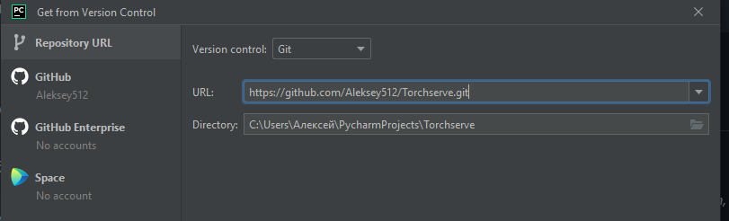

# Начало

### 🚀 Быстрое начало (Windows)


> 1. Забрать [репозиторий с Torchserve](https://github.com/Aleksey512/Torchserve)
>> * С помощью командной строки
>>```commandline
>>git clone https://github.com/Aleksey512/Torchserve.git
>>
>># Или если есть SSH ключ
>>
>>git clone git@github.com:Aleksey512/Torchserve.git 
>>```
>> * С помощью IDE (На примере [PyCharm](https://www.jetbrains.com/ru-ru/pycharm/))
>> 
>> 
> 2. Установить [Docker](https://www.docker.com/)
>> Для него понадобится установить wsl2
>> 
>> Для этого открывам PowerShell с правами администратора и выполняем команду
>>
>> ```shell
>> wsl --install
>>```
>> Подробный процесс установки описан на сайте [Microsoft](https://docs.microsoft.com/ru-ru/windows/wsl/install-win10), там же указаны минимальные требования.
